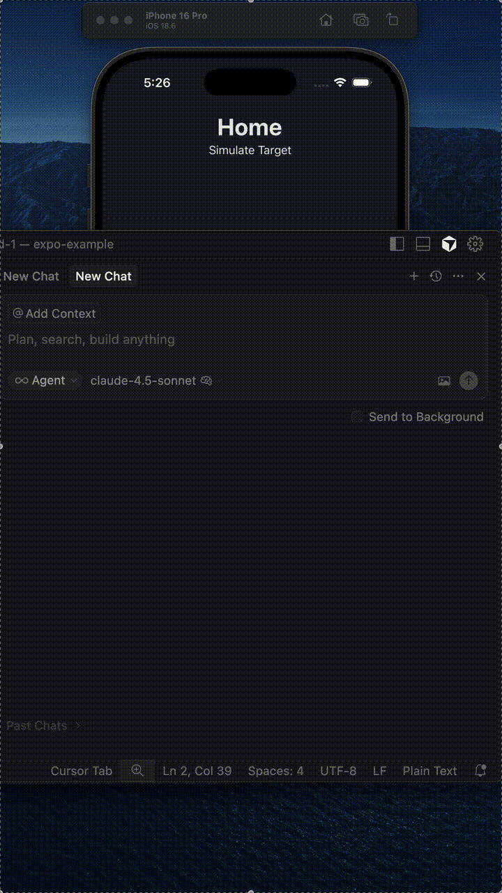

# **Agenteract**

[](https://github.com/agenteract/agenteract/actions/workflows/ci.yml)
[](https://github.com/agenteract/agenteract/actions/workflows/flutter-tests.yml)
[](https://github.com/agenteract/agenteract/actions/workflows/integration-test.yml)
[](https://github.com/agenteract/agenteract/actions/workflows/e2e-vite.yml)
[](https://github.com/agenteract/agenteract/actions/workflows/e2e-vite-windows.yml)
[](https://github.com/agenteract/agenteract/actions/workflows/e2e-flutter.yml)
[](https://github.com/agenteract/agenteract/actions/workflows/e2e-expo.yml)
[](https://github.com/agenteract/agenteract/actions/workflows/e2e-kotlin.yml)

*Let your agents interact...*

**Agenteract** is an experimental bridge that lets coding agents *view* and *interact* with running applications - Including React Native / Expo, React, Kotlin Multi Platform, and Swift UI. It's possible to add support for your favorite stack by replicating the existing framework implementations.

Agenteract exposes the app’s internal state, view hierarchy, and actionable controls over a secure WebSocket, enabling agents (or test harnesses) to observe and trigger UI events just like a developer or user would.

   <p align="center">
     
   </p>

---

## **🎯 Motivation**

Most AI agent workflows rely on web specific testing methodoligies to achieve app interaction. Others rely on vision or accessibility APIs to understand an app’s UI.  
  The vision approach is heavy, both are slow, and unreliable.  
  Agenteract flips the model — apps can **self-report** their structure and controls in a simple, semantic format.

With Agenteract, agents no longer have to guess what’s on screen; they can query the actual component tree and call meaningful actions.

---

## **🧩 Core Concepts**

| Concept | Description |
| ----- | ----- |
| **Bridge** | A lightweight WebSocket endpoint inside the app (AgentDebugBridge, AgenteractBridge, etc.) that sends UI snapshots and receives action commands. |
| **Hierarchy Provider** | Gathers a filtered React Fiber tree with component names, testIDs, and text. |
| **Agent Registry** | Maps component actions (for example, onPress or onChangeText) to callable handlers. |
| **Agent Commands** | JSON messages such as `{ "action": "tap", "target": "loginButton" }`. |
| **Protocol** | Human-readable JSON over WebSocket; future versions will support HTTP and gRPC. |

---

## **🧱 Example Flow**

**Agent requests hierarchy**

`{ "action": "getViewHierarchy" }`

**App responds**

`{ "status": "success", "hierarchy": { "root": "main(RootComponent)", "children": [...] } }`

**Agent performs action**

`{ "action": "press", "target": "loginButton" }`

**App executes bound handler and returns**

`{ "status": "ok", "result": "Button pressed" }`

---

## **⚙️ Packages**

| Package | Purpose |
| ----- | ----- |
| `@agenteract/core` | Core schema, message protocol, and bridge utilities |
| `@agenteract/react` | React / React Native bindings (`useAgentBinding`, registry hooks) |
| `@agenteract/cli` | Unified command-line interface for Agenteract |
| `@agenteract/pty` | Simple package that wraps dev servers and exposes interaction APIs via websockets |
| `@agenteract/server` | Agent command server and runtime bridge |
| `@agenteract/agents` | Agent instructions installer (creates AGENTS.md) |
| `@agenteract/dom` | DOM utilities for web applications |
| [agenteract-swift](https://github.com/agenteract/agenteract-swift) | iOS / Swift Bindings / Package
| [flutter](./packages/flutter/) | Flutter Bindings Package
| `@agenteract/kotlin` | Kotlin Multiplatform Bindings Package

## 🚀 Getting Started

## **1. Installation**

### Agent Based

The easiest way to get started is to let your coding agent do the work. First, create an `AGENTS.md` file:
```bash
npx @agenteract/agents md
```

You can also specific the name:
```bash
npx @agenteract/agents md CLAUDE.md
```

This appends the Agenteract instructions to your agents markdown.

Next, restart your coding CLI or open a new chat tab (Cursor), then give ask it to complete the setup:

"Please add Agenteract support and make sure it works."

### Manual

First, you'll need to install the Agenteract CLI. This tool manages the communication between the AI agent and your local development servers.

```bash
npm install -g @agenteract/cli
```

Next, install the appropriate package for your project.

**For React Native (Expo):**

```bash
npm install @react-native-async-storage/async-storage expo-linking
```

**For React (Vite):**

```bash
npm install @agenteract/react
```

## **2. AGENTS.md**

Next, install `AGENTS.md` - This will allow your coding assistant to understand how agenteract works.

If you already have an `AGENTS.md`, our contents will be appended.

You can also specify the output filename.

```bash
npx @agenteract/agents [FILENAME.md]
```

Now you can reference the file for your agent in a message, or restart the CLI for it to take effect.

At this point you can ask your agent to start setting up Agenteract.

## **3. Configuration**

The command below will create an initial `agenteract.config.js`, or add entries to an existing configuration.

**New Format (Generic Dev Server):**
```bash
npx @agenteract/cli add-config <path> <projectName> <command> [port] --scheme myapp
```
`port` is auto assigned if not provided. This is the port that Agenteract uses to communicate internally, it's not where the dev server hosts files.

**Parameters:**
- `path`: Path to the project directory
- `projectName`: Project name as supplied to `AgentDebugBridge`
- `command`: Dev server command (e.g., `"npm run dev"`, `"remix dev"`)
- `port` (optional): PTY bridge port (auto-assigned if omitted)
- `--scheme myapp`: Scheme used for QR code / deep link pairing: See [Configuring Deep Linking](#configuring-deep-linking)


Examples:
```bash
# Expo Go - Supports exp:// scheme by default, the CLI will run from CWD
npx @agenteract/cli add-config . expo-app "npx expo" --scheme exp

# The following examples specify relative paths as would be the case in a mono repo
# Next.js app with explicit port
npx @agenteract/cli add-config ./apps/web next-app "npm run dev" --port 8791

# Remix app with auto-assigned port
npx @agenteract/cli add-config ./apps/remix remix-app "remix dev"

# Custom dev server
npx @agenteract/cli add-config ./apps/custom my-app "pnpm start:dev"
```

Here is an example configuration for a monorepo containing multiple projects:

```javascript
// agenteract.config.js
export default {
  /**
   * The port for the central Agenteract server.
   * The agent connects to this port.
   */
  port: 8766,

  /**
   * An array of projects to manage.
   */
  projects: [
    {
      // A unique identifier for this app. Used for targeting commands.
      name: 'expo-app',
      // The path to the app's root directory, relative to this config file.
      path: './examples/expo-example',
      // Generic dev server configuration
      devServer: {
        command: 'npx expo start',
        port: 8790,
      },
      "scheme": "myapp"
    },
    {
      name: 'react-app',
      path: './examples/react-example',
      devServer: {
        command: 'npx vite',
        port: 8791,
      }
    },
    {
      name: 'flutter-app',
      path: './examples/flutter_example',
      devServer: {
        command: 'flutter run',
        port: 8792,
        validation: {
          fileExists: ['pubspec.yaml'],
          commandInPath: 'flutter',
        }
      }
    },
    {
      name: 'next-app',
      path: './apps/web',
      devServer: {
        command: 'npm run dev',
        port: 8793,
      }
    },
    {
      name: 'swift-app',
      path: './examples/swift-app',
      type: 'native'  // Native apps don't have dev servers
    }
  ],
};
```

### Configuration Options

-   `port`: The main port for the Agenteract server.
-   `projects`: An array of project objects.
    -   `name`: A unique name for your app (used in agent commands).
    -   `path`: The relative path to your app's root directory.
    -   `devServer`: Dev server configuration (optional for native apps).
        -   `command`: The shell command to start the dev server (e.g., `'npm run dev'`, `'flutter run'`).
        -   `port`: A unique port for the PTY (pseudo-terminal) bridge.
        -   `cwd`: (Optional) Override working directory.
        -   `env`: (Optional) Additional environment variables.
        -   `validation`: (Optional) Pre-flight checks.
            -   `fileExists`: Files that must exist (e.g., `['package.json']`).
            -   `commandInPath`: Commands that must be in PATH (e.g., `'node'`, `'flutter'`).
            -   `errorHints`: Custom error messages for common issues.
        -   `scheme`: (Optional) Scheme used for QR code / deep link pairing: See [Configuring Deep Linking](#configuring-deep-linking)
    -   `type`: (Deprecated) Legacy type field. Use `devServer` instead.

**Note:** The old `type` and `ptyPort` fields are deprecated but still supported for backward compatibility. See `docs/MIGRATION_V2.md` for migration instructions.

`agenteract.config.js` should not be tracked as it may be specific to your local environment.

## **4. Instrumenting Your Application**

To allow Agenteract to "see" and interact with your application, you need to add the `AgentBridge` component to your app's entry point.

### Platform-Specific Setup

For **physical device testing** (React Native, Expo, Swift, Kotlin), you'll also need to configure deep linking to enable secure pairing. See platform-specific instructions below.

**For React Native / Expo - `App.tsx`:**

React Native, Expo, React all use the same import `@agenteract/react`.

Previously Expo and Vite specific packages were used to provide dev server wrappers, but this is now generalized.

```tsx
import { View, Text } from 'react-native';
import { AgentDebugBridge } from '@agenteract/react';

export default function App() {
  return (
    <View style={{ flex: 1 }}>
      {/* Your existing application */}
      <Text>Welcome to my app!</Text>

      {/* Add the AgentDebugBridge */}
      { __DEV__ && <AgentDebugBridge projectName="expo-app" /> }
    </View>
  );
}
```

**For React (Vite) - `src/App.tsx`:**

```tsx
import { AgentDebugBridge } from '@agenteract/react';

function App() {
  return (
    <>
      {/* Your existing application */}
      <h1>Welcome to my app!</h1>

      {/* Add the AgentBridge */}
      { __DEV__ && <AgentDebugBridge projectName="vite-app" /> }
    </>
  );
}

export default App;
```

**For Flutter `lib/main.dart`**:

* AgentDebugBridge example:

https://raw.githubusercontent.com/agenteract/agenteract/refs/heads/main/examples/flutter_example/lib/main.dart

* Packages:
`agenteract` (Git or local path - not yet on pub.dev)

Installation:
```yaml
dependencies:
  agenteract:
    git:
      url: https://github.com/agenteract/agenteract.git
      path: packages/flutter
```

The following can be installed either in the app, or at the monorepo root if applicable.

`@agenteract/cli`

`@agenteract/server`

`@agenteract/agents`

Usage:

```dart
import 'package:agenteract/agenteract.dart';
import 'package:flutter/foundation.dart';
// ...
if (kDebugMode) {
  return AgentDebugBridge(
    projectName: 'myFlutterApp',
    child: MyApp(),
  );
}
```

Making widgets interactive:

```dart
// Use the .withAgent() extension on any widget
ElevatedButton(
  onPressed: () => print('clicked'),
  child: Text('Click me'),
).withAgent('submit-button', onTap: () => print('clicked'))

// Text input
TextField(
  onChanged: (text) => print(text),
).withAgent('username-input', onChangeText: (text) => print(text))
```

**For Swift UI**

See [agenteract-swift](https://github.com/agenteract/agenteract-swift)

**For Kotlin Multiplatform (Compose Multiplatform)**

Consult [packages/kotlin/README.md](packages/kotlin/README.md) for installation and usage instructions.

## **5. Running Agenteract**

With your configuration in place and your app instrumented, you can now start Agenteract.

Open a terminal and run the following command from the root of your project (where your `agenteract.config.js` is located):

```bash
npx @agenteract/cli dev
```

This command will:
-   Start the central Agenteract server on the configured `port`.
-   Start a PTY bridge for each project on its configured `ptyPort`.
-   Automatically start the development server for each of your configured projects (e.g., `npm run dev` or `npx expo start`).

### Connecting Devices

**For Simulators/Emulators and Web Apps:**
Applications automatically connect to `localhost:8765` - no additional setup needed!

**For Physical Devices (React Native, Expo, Swift, Kotlin):**

Physical devices require deep link pairing for secure connections:

1. **Configure your app's URL scheme** (if not already done):
   ```bash
   npx @agenteract/cli add-config . my-app native --scheme myapp
   ```

   For Expo Go, use scheme `exp`:
   ```bash
   npx @agenteract/cli add-config . my-app expo --scheme exp
   ```

2. **Start the dev server** (if not already running):
   ```bash
   npx @agenteract/cli dev
   ```

3. **Connect your physical device**:
   ```bash
   npx @agenteract/cli connect
   ```

4. **Scan the QR code** displayed in the terminal with your device camera

The deep link will configure your app with the server's IP address, port, and authentication token. This configuration is saved permanently and used for all future connections.

**Platform-Specific Deep Linking Setup:**
- **React/Expo**: See [packages/react/README.md](packages/react/README.md#deep-linking--configuration)
- **Flutter**: See [packages/flutter/README.md](packages/flutter/README.md#deep-linking--physical-device-setup)
- **Swift/iOS**: See [agenteract-swift README](https://github.com/agenteract/agenteract-swift#deep-linking--configuration)
- **Kotlin/Android**: See [packages/kotlin/README.md](packages/kotlin/README.md#deep-linking--configuration)

Device information is stored in `.agenteract-runtime.json`. This file should not be checked in to SCM.

### Agent Interaction

AI agents can now connect to the Agenteract server using the tools described in `AGENTS.md`. The agent can view your app's component hierarchy and perform actions like tapping buttons or typing into text fields.

Your agent is now ready to Agenteract!

### Programmatic Testing with AgentClient

For Node.js integration tests and automation scripts, Agenteract provides the **AgentClient** API - a programmatic alternative to CLI commands:

```typescript
import { AgentClient } from '@agenteract/core/node';

const client = new AgentClient('ws://localhost:8765');
await client.connect();

// Interaction primitives
await client.tap('expo-app', 'login-button');
await client.input('expo-app', 'username', 'john@example.com');
const hierarchy = await client.getViewHierarchy('expo-app');

// Utilities with real-time streaming
await client.waitForLog('expo-app', 'Login successful', 5000);
await client.waitForElement('expo-app', 'dashboard', 5000);

// Cleanup
client.disconnect();
```

**Benefits of AgentClient:**
- **Faster execution**: WebSocket connection vs subprocess overhead
- **Real-time log streaming**: Stream logs as they happen
- **Type-safe**: Full TypeScript support with IDE autocomplete
- **Better error handling**: Promise-based with structured errors
- **Native async/await**: Clean, readable test code

**When to use each approach:**
- **CLI commands** (`pnpm agenteract-agents tap ...`): For AI agents, manual testing, CI scripts
- **AgentClient** (TypeScript/Node.js): For integration tests, test frameworks (Jest/Mocha), automation

**Complete example:** See [`tests/e2e/node-client/test-agent-client.ts`](tests/e2e/node-client/test-agent-client.ts) for a full testing workflow.

**All methods available:**
- `tap(project, testID)` - Tap a component
- `input(project, testID, value)` - Input text into a field
- `scroll(project, testID, direction, amount?)` - Scroll a view
- `swipe(project, testID, direction, velocity?)` - Swipe gesture
- `longPress(project, testID)` - Long press a component
- `getViewHierarchy(project)` - Get UI hierarchy
- `agentLink(project, url)` - Send deep link action
- `getLogs(project, count?)` - Get console logs
- `waitForLog(project, pattern, timeout?)` - Wait for log message
- `waitForElement(project, testID, timeout?)` - Wait for element
- `waitForCondition(project, predicate, timeout?)` - Wait for custom condition

### Agent Links (agentLink)

**Agent Links** provide a way to trigger app-specific actions through deep link-style URLs sent over the WebSocket connection. Unlike pairing deep links (which configure the server connection), agentLinks are sent to already-connected apps to trigger custom behaviors.

**Use Cases:**
- Reset app state during automated testing
- Navigate to specific screens
- Reload or restart the app
- Trigger custom app actions

**Command:**
```bash
npx @agenteract/cli agent-link <project> <url>
```

**Examples:**
```bash
# Reset application state
npx @agenteract/cli agent-link expo-app agenteract://reset_state

# Navigate to a specific screen
npx @agenteract/cli agent-link expo-app agenteract://navigate?screen=settings

# Reload the application
npx @agenteract/cli agent-link expo-app agenteract://reload
```

**Implementation:**

To handle agentLinks in your application, provide an `onAgentLink` handler to `AgentDebugBridge`:

**React/Expo:**
```tsx
import { AgentDebugBridge } from '@agenteract/react';

const handleAgentLink = async (url: string): Promise<boolean> => {
  const { hostname, queryParams } = parseURL(url);
  
  switch (hostname) {
    case 'reset_state':
      // Reset your app state
      resetAppState();
      return true; // Handled by app
    case 'navigate':
      // Navigate to screen from query params
      navigation.navigate(queryParams.screen);
      return true;
    default:
      return false; // Let AgentDebugBridge handle config links
  }
};

<AgentDebugBridge 
  projectName="expo-app"
  onAgentLink={handleAgentLink}
/>
```

**Flutter:**
```dart
import 'package:agenteract/agenteract.dart';

Future<bool> handleAgentLink(String url) async {
  final uri = Uri.parse(url);
  
  switch (uri.host) {
    case 'reset_state':
      // Reset your app state
      resetAppState();
      return true;
    case 'navigate':
      // Navigate to screen
      Navigator.pushNamed(context, uri.queryParameters['screen'] ?? '/');
      return true;
    default:
      return false;
  }
}

AgentDebugBridge(
  projectName: 'flutter-app',
  onAgentLink: handleAgentLink,
  child: MyApp(),
)
```

**Kotlin (Compose Multiplatform):**
```kotlin
import io.agenteract.AgentDebugBridge

val handleAgentLink: suspend (String) -> Boolean = { url ->
    val uri = URI(url)
    when (uri.host) {
        "reset_state" -> {
            resetAppState()
            true
        }
        "navigate" -> {
            val screen = uri.query?.split("=")?.get(1)
            navController.navigate(screen ?: "home")
            true
        }
        else -> false
    }
}

AgentDebugBridge(
    projectName = "kmp-app",
    onAgentLink = handleAgentLink
)
```

**Return Values:**
- Return `true` if your handler processes the agentLink
- Return `false` to let `AgentDebugBridge` handle it (for pairing/config links)

**URL Format:**
- Scheme: `agenteract://`
- Hostname: Action identifier (e.g., `reset_state`, `navigate`, `reload`)
- Query parameters: Optional parameters (e.g., `?screen=settings&tab=profile`)

**Helper Utilities:**

The example apps include URL parsing utilities:
- `/examples/expo-example/app/utils/deepLinkUtils.ts`
- `/examples/react-example/src/utils/deepLinkUtils.ts`

These provide a `parseURL()` function to extract the hostname and query parameters from agentLink URLs.

---

## **🔒 Security & Scope**

* Designed for **local development, testing, and accessibility research**.

* Future versions will include authentication, session control.

---

## **⛏️ Development**

This guide covers how to set up the local development environment to run the Expo example app and the agent server.

See [docs/ARCHITECTURE.md](./docs/ARCHITECTURE.md) for in depth information about the project structure.

### **1. Prerequisites**

First, clone the repository and ensure you have [pnpm](https://pnpm.io/) installed.

```bash
git clone https://github.com/agenteract/agenteract.git
cd agenteract
git submodule update --init --recursive
npm install -g pnpm
```

### **2. Install Dependencies & Build**

Install all dependencies for the monorepo and build the packages from the root directory.

```bash
npm install -g pnpm
pnpm install
pnpm build
```

We need to use linking to work locally:

Usage:
```bash
cd packages/server
pnpm link --global
cd packages/agents
pnpm link --global
cd packages/cli
pnpm link --global
cd packages/pty
pnpm link --global

```

### **3. Run the Development Environment**

Start the Agenteract development environment using the unified CLI:

```bash
pnpm agenteract dev

# once published, you can use:
npx @agenteract/cli dev
```

This will:
- Start the central Agenteract server
- Start PTY bridges for each configured project
- Automatically launch all development servers defined in your `agenteract.config.js`

The multiplexed output will show logs from all your running applications in a single terminal.

### **4. Observe and Interact**

Once the app is running, it will automatically connect to the agent server. You should see connection logs in the multiplexed output.

You can manually simulate an agent command to test the connection:

```bash
curl -s -X POST http://localhost:8766/expo-app -d '{"action":"getViewHierarchy"}'
```

The server will forward this to the app, and the app will respond with a JSON payload of its view hierarchy.

### **5. Agent Interaction**

This step creates or appends to your AGENTS.md file. This informs coding agents how to interact with the app.

```bash
npx @agenteract/agents md [dest] # You can specific the name, eg AGENTERACT.md
```

It is advisible to filter the documentation specific to your app. Agents are great at this!
```prompt
Please filter AGENTERACT.md - We want to remove anything that isn't relevant to this <project type> app.
```

You can then turn `AGENTERACT.md` into skills:

Claude Code:
```prompt
Please convert AGENTERACT.md into skills as per https://code.claude.com/docs/en/skills
Place the skills folders within this app repo.
```

OpenCode:
```prompt
Please convert AGENTERACT.md into skills as per https://code.claude.com/docs/en/skills
Place the skills folders within this app repo.
```


If you are using a separate agent to your IDE, start it now, otherwise you can use the built in agent (Tested with Cursor, Gemini CLI)

Issue some instructions. You might need to prime the agent the first time
```txt
You can use the Get View Hieararchy tool to inspect the current app state.
Add a button that disappears when it is clicked.
Confirm that it works using a simulated action.
```

Agents should view the current hierarchy, modify the code, view again, simulate a tap, then confirm that the button disappeared by viewing the hierarchy one final time.

Because [packages/agents/AGENTS.md](packages/agents/AGENTS.md) contains instructions about how to interact with the app, you don't need to explicitly tell it to use the `AgentDebugBridge`.

### **✅ Verification Checklist**

*   All packages build successfully with `pnpm build`.
*   The Agenteract server starts and listens on the configured port (default 8766).
*   All configured apps start and connect to the server.
*   The multiplexed output shows connection messages from your apps.
*   Sending a `getViewHierarchy` command via `curl` to your app returns a JSON tree.

## **🧪 Testing**

This project uses Jest for testing.

### **Run All Tests**

To run the tests for all packages, use the following command from the root directory:

```bash
pnpm test
```

### **Run Tests for a Single Package**

To run the tests for a specific package, use the `--filter` flag:

```bash
pnpm --filter @agenteract/react test
```

### **Continuous Integration**

Tests are run automatically on every push and pull request to the `main` branch using GitHub Actions.

### **Integration Testing**

Integration tests verify that packages can be installed and used correctly after publication. They use [Verdaccio](https://verdaccio.org/), a lightweight private npm registry running in Docker.

**Local testing workflow:**

```bash
# run some basic tests
pnpm test:full_integration
```

We can also run a full set of e2e tests locally. These tests confirm that the AgentDebugBridge and dev cli work together.

```bash
pnpm test:e2e:vite
pnpm test:e2e:flutter:ios
# Expo is currently disabled in CI as there is an undiagnosed issue where the app doesn't respond
pnpm test:e2e:expo:ios
pnpm test:e2e:kotlin
```

**Verdaccio Caching**
As the verdaccio startup and publishing process takes time, we use a semi persistent proces in dev.
We have logic for caching packages and generating new local versions when builds changed.

The following pnpm commands are available to manage verdaccio:

| Command | Description |
| ----- | ----- |
| pnpm verdaccio:start | Starts the verdaccio server |
| pnpm verdaccio:stop | Stops the verdaccio server |
| pnpm verdaccio:publish | Publishes packages to the local verdaccio registry |
| pnpm verdaccio:publish:no-cache | Publishes packages to the local verdaccio registry without using cache |
| pnpm verdaccio:clean | Cleans the verdaccio cache and restarts the server |
| pnpm verdaccio:test | Tests verdaccio authentication |
| pnpm cache:clear:verdaccio | Clears the verdaccio cache |

The caching process usually works seemlessly (just run e2e tests), however to be sure, you might want to clear and restart:
```
pnpm verdaccio:start
pnpm verdaccio:clean
pnpm build
pnpm verdaccio:publish
```

**GitHub Actions:** Integration tests run automatically on PRs and pushes to `main` and `release/**` branches using Verdaccio as a service container.

**Authentication:** Uses `expect` to automate the authentication process. See [docs/VERDACCIO_AUTH.md](docs/VERDACCIO_AUTH.md) for details.

See [docs/INTEGRATION_TESTING.md](docs/INTEGRATION_TESTING.md) for complete information.

## **📱 App Lifecycle Management**

Agenteract provides CLI commands to manage app launching, stopping, building, and setup operations across all supported platforms (React/Vite, Expo, Flutter, Swift, Kotlin).

### **Launch an App**

Launch your app on a device or simulator:

```bash
npx @agenteract/agents start-app <project> [options]
```

**Options:**
- `--device <id>` - Target specific device/simulator ID
- `--platform <type>` - Override platform detection (vite, expo, flutter, xcode, kmp-android, kmp-desktop)
- `--headless` - Launch browser in headless mode (web apps only)
- `--prebuild` - Use an Expo prebuild (native build) instead of Expo Go (Expo projects only)
- `--launch-only` - Skip build and install steps; launch the already-installed app directly

**Examples:**
```bash
# Launch with auto-detected platform and default device
npx @agenteract/agents start-app expo-app

# Launch on specific iOS simulator
npx @agenteract/agents start-app expo-app --device "iPhone 15 Pro"

# Launch Flutter app on Android with explicit platform
npx @agenteract/agents start-app flutter-app --platform flutter --device emulator-5554

# Launch web app in headless mode
npx @agenteract/agents start-app vite-app --headless

# Launch Expo prebuild (native build) instead of Expo Go
npx @agenteract/agents start-app expo-app --prebuild --device "iPhone 15 Pro"

# Launch without rebuilding or reinstalling (app must already be installed)
npx @agenteract/agents start-app expo-app --launch-only --device "iPhone 15 Pro"
```

### **Stop an App**

Stop a running application:

```bash
npx @agenteract/agents stop-app <project> [options]
```

**Options:**
- `--device <id>` - Target specific device ID
- `--force` - Force stop (Android: `force-stop` instead of `stop`, Desktop: SIGKILL instead of SIGTERM)
- `--prebuild` - Target an Expo prebuild app instead of Expo Go (Expo projects only)

**Examples:**
```bash
# Stop app gracefully
npx @agenteract/agents stop-app expo-app

# Force stop on specific device
npx @agenteract/agents stop-app expo-app --device emulator-5554 --force

# Stop Expo prebuild app
npx @agenteract/agents stop-app expo-app --prebuild
```

### **Build an App**

Build your application for a target platform:

```bash
npx @agenteract/agents build <project> [options]
```

**Options:**
- `--platform <type>` - Target platform (vite, expo, flutter, xcode, kmp-android, kmp-desktop)
- `--config <type>` - Build configuration: `debug` (default) or `release`

**Examples:**
```bash
# Build debug version with auto-detected platform
npx @agenteract/agents build flutter-app

# Build release version for Android
npx @agenteract/agents build flutter-app --platform flutter --config release

# Build Swift iOS app
npx @agenteract/agents build swift-app --platform xcode --config debug
```

### **Setup Operations**

Perform setup operations like install, reinstall, or clear app data:

```bash
npx @agenteract/agents setup <project> <action> [options]
```

**Actions:**
- `install` - Install the app on device
- `reinstall` - Uninstall and reinstall the app
- `clearData` - Clear app data/cache (Android) or uninstall (iOS)

**Options:**
- `--device <id>` - Target specific device ID
- `--platform <type>` - Override platform detection

**Examples:**
```bash
# Install app on default device
npx @agenteract/agents setup expo-app install

# Reinstall on specific device
npx @agenteract/agents setup flutter-app reinstall --device emulator-5554

# Clear app data (Android) or uninstall (iOS)
npx @agenteract/agents setup expo-app clearData --platform expo
```

### **Lifecycle Configuration**

Add optional lifecycle configuration to your `agenteract.config.js`:

```javascript
export default {
  projects: [
    {
      name: 'expo-app',
      path: './examples/expo-app',
      devServer: { command: 'npx expo start', port: 8790 },
      lifecycle: {
        bundleId: {
          ios: 'com.example.expoapp',
          android: 'com.example.expoapp'
        },
        mainActivity: 'com.example.expoapp.MainActivity', // Android only
        launchTimeout: 30000, // ms, default: 30000
        requiresInstall: false // default: false
      }
    }
  ]
};
```

**Configuration Options:**
- `bundleId` - App bundle identifier (auto-detected from app.json, Info.plist, build.gradle if not specified)
- `mainActivity` - Android main activity class (auto-detected from AndroidManifest.xml if not specified)
- `launchTimeout` - Maximum time to wait for app launch in milliseconds
- `requiresInstall` - Whether setup operations should install before launching

### **Device Management**

Agenteract automatically detects and manages devices:

**Default Device Selection:**
- Explicit `--device` flag takes highest priority
- Falls back to default device from `.agenteract-runtime.json`
- For iOS: Uses booted simulator or first available
- For Android: Uses first device from `adb devices`

**Set Default Device:**
```bash
# Device info is automatically saved when you use --device flag
npx @agenteract/agents start-app expo-app --device "iPhone 15 Pro"

# Future launches will use this device by default
npx @agenteract/agents start-app expo-app
```

Default device configuration is stored in `.agenteract-runtime.json` (should not be committed to SCM).

### **Platform Detection**

Agenteract auto-detects your platform by scanning for marker files:

| Platform | Marker Files |
|----------|-------------|
| **Vite** | `vite.config.ts`, `vite.config.js` |
| **Expo** | `app.json` with `expo` key |
| **Flutter** | `pubspec.yaml` |
| **Xcode (Swift/Objective-C)** | `Package.swift`, `.xcodeproj` |
| **KMP Android** | `build.gradle.kts` with Kotlin/Android |
| **KMP Desktop** | `build.gradle.kts` with Compose Desktop |

You can override detection with the `--platform` flag.

### **Releases & Publishing**

We support multiple release strategies with automated NPM publishing:

```bash
# Version bump and release (all packages)
pnpm version:patch  # 1.0.0 → 1.0.1
pnpm version:minor  # 1.0.0 → 1.1.0
pnpm version:major  # 1.0.0 → 2.0.0

# Version bump for specific packages
./scripts/version.sh minor agents        # Single package
./scripts/version.sh patch core,react    # Multiple packages

# Push tags to trigger NPM publish
git push && git push --tags
```

**Prerelease testing:**
```bash
pnpm version:alpha   # All packages
pnpm version:beta    # All packages
pnpm version:rc      # All packages

./scripts/version.sh alpha agents        # Single package
./scripts/version.sh beta agents,core    # Multiple packages

git push && git push --tags
# Published with @next tag on NPM
```

See [docs/RELEASE_PROCESS.md](docs/RELEASE_PROCESS.md) for the complete release guide and [docs/CI_CD_SUMMARY.md](docs/CI_CD_SUMMARY.md) for a quick reference.

## **📜 License**

This project uses dual licensing:

- **MIT License**: Most packages (`@agenteract/react`, `@agenteract/expo`, `@agenteract/vite`, `@agenteract/flutter-cli`, `@agenteract/flutter`, `@agenteract/cli`, `@agenteract/server`, `@agenteract/dom`, `@agenteract/gemini`, `@agenteract/kotlin`)
- **Apache-2.0 License**: Core infrastructure packages (`@agenteract/core`, `@agenteract/agents`, `@agenteract/pty`)

Copyright © 2025 Agenteract Project.

---

[https://agenteract.io/](https://agenteract.io/)
