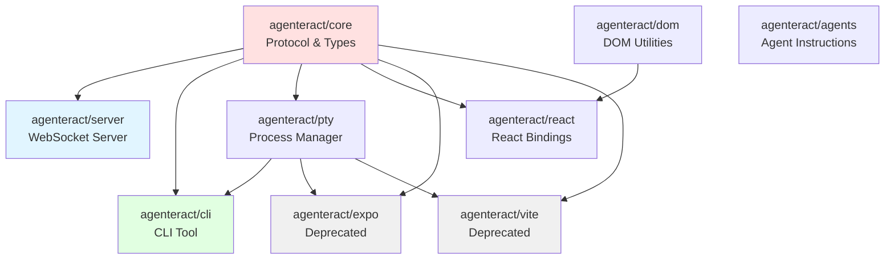
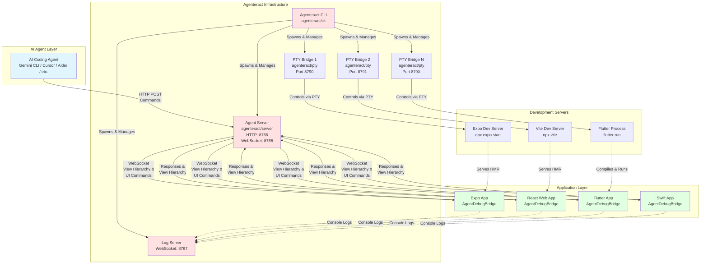
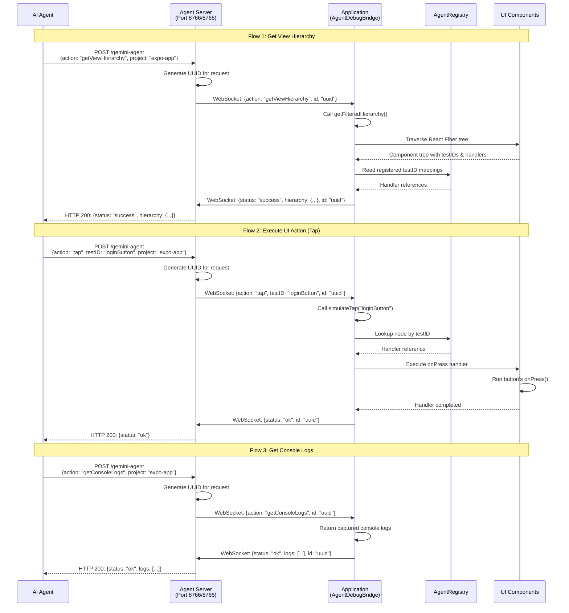
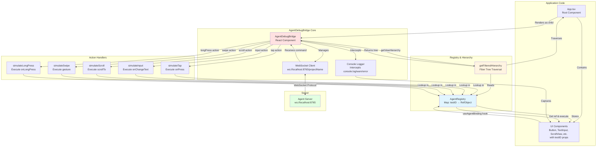
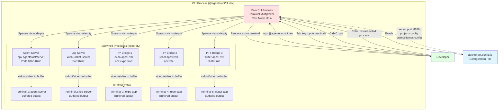
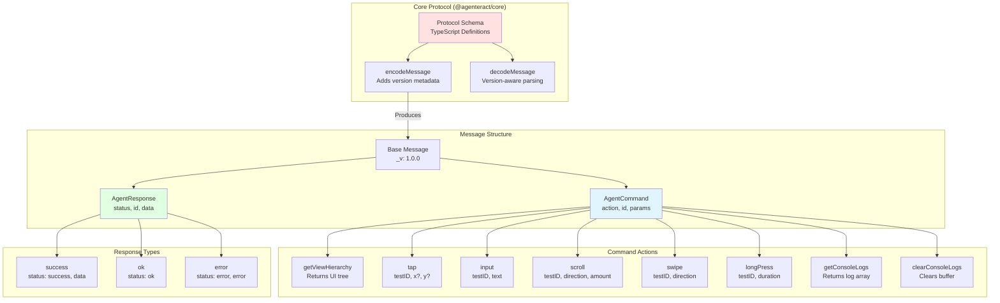
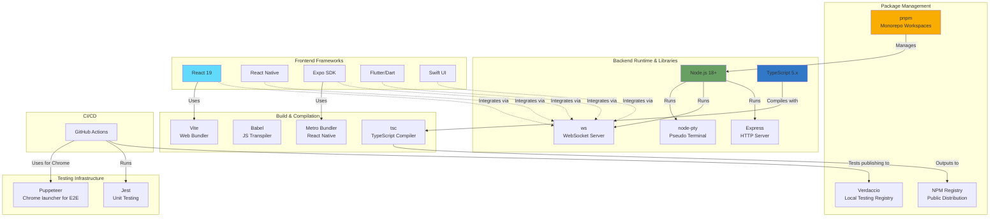
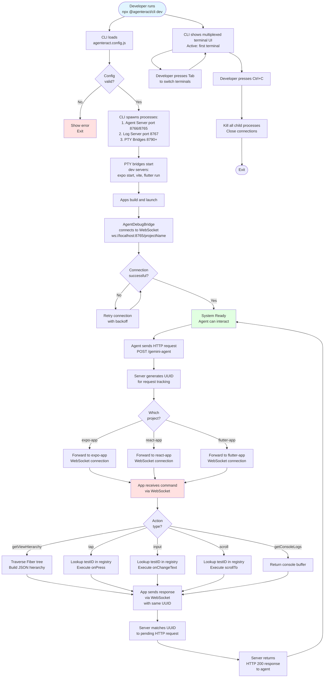

# Agenteract Architecture Documentation

## Table of Contents

1. [Project Overview](#1-project-overview)
2. [Monorepo Structure](#2-monorepo-structure)
3. [Core Packages](#3-core-packages)
4. [System Architecture](#4-system-architecture)
5. [Communication Flow](#5-communication-flow)
6. [AgentDebugBridge Component Architecture](#6-agentdebugbridge-component-architecture)
7. [CLI Development Environment](#7-cli-development-environment)
8. [Protocol & Message Format](#8-protocol--message-format)
9. [Technology Stack](#9-technology-stack)
10. [Key Architectural Patterns](#10-key-architectural-patterns)
11. [Data Flow Summary](#11-data-flow-summary)
12. [Port Allocation](#12-port-allocation)
13. [Security & Scope](#13-security--scope)

---

## 1. Project Overview

**Agenteract** is an experimental bridge framework that enables AI agents to interact with running applications in real-time. Instead of relying on vision or accessibility APIs, applications self-report their UI structure and expose actionable controls over WebSocket connections.

### Key Features

- **Real-time view hierarchy inspection**: AI agents can query the complete UI tree structure
- **Programmatic UI interaction**: Execute actions like tap, input, scroll, swipe programmatically
- **Multi-platform support**: Works with React Native, React Web, Flutter, and Swift UI
- **Developer-friendly monorepo**: Organized workspace with shared packages
- **WebSocket-based protocol**: Low-latency bidirectional communication

### Use Cases

- AI-driven development and testing
- Automated UI testing workflows
- Interactive debugging and inspection
- Agent-assisted application development

---

## 2. Monorepo Structure

The project is organized as a **pnpm workspace monorepo** with the following structure:

```
agenteract/
├── packages/           # Core packages
│   ├── core/          # Protocol definitions & utilities
│   ├── server/        # WebSocket & HTTP server
│   ├── cli/           # Command-line interface
│   ├── pty/           # Generic process manager
│   ├── react/         # React/React Native bindings
│   ├── expo/          # Expo utilities (deprecated)
│   ├── vite/          # Vite utilities (deprecated)
│   ├── flutter-cli/   # Flutter CLI wrapper
│   ├── flutter/       # Flutter package (Dart)
│   ├── dom/           # DOM utilities
│   ├── agents/        # Agent instruction installer
│   └── gemini/        # Gemini integration
├── examples/          # Example applications
│   ├── expo-example/
│   ├── react-example/
│   ├── flutter_example/
│   └── swift-app/
├── tests/             # Test suites
│   ├── integration/
│   └── e2e/
└── docs/              # Documentation
```

---

## 3. Core Packages

### Package Overview

| Package | Version | Purpose | Key Dependencies |
|---------|---------|---------|------------------|
| **@agenteract/core** | 0.0.3 | Protocol schema, message encoding/decoding | None (base package) |
| **@agenteract/server** | 0.0.4 | WebSocket + HTTP server for agent communication | ws, express, uuid |
| **@agenteract/cli** | 0.0.8 | Unified CLI for managing dev environment | @agenteract/core, yargs, node-pty |
| **@agenteract/pty** | 0.0.4 | Generic PTY process manager for dev servers | @agenteract/core, express, node-pty |
| **@agenteract/react** | 0.0.4 | React/React Native bridge component | @agenteract/core, @agenteract/dom |
| **@agenteract/dom** | 0.0.2 | DOM utilities for web applications | None |
| **@agenteract/agents** | 0.0.10 | Agent instruction installer (creates AGENTS.md) | axios, glob, yargs |
| **@agenteract/expo** | 0.0.3 | Expo wrapper (deprecated) | @agenteract/core, @agenteract/pty |
| **@agenteract/vite** | 0.0.3 | Vite wrapper (deprecated) | @agenteract/core, @agenteract/pty |
| **@agenteract/flutter-cli** | - | Flutter CLI wrapper | - |

### Package Relationships



---

## 4. System Architecture

The following diagram illustrates the high-level system architecture showing how all components interact:



### Architecture Layers

1. **AI Agent Layer**: External AI agents (Gemini, Cursor, Aider) that send commands
2. **Infrastructure Layer**: Core services (CLI, Server, PTY bridges) that orchestrate the system
3. **Application Layer**: Running apps with AgentDebugBridge integration
4. **Development Server Layer**: Framework-specific dev servers for hot reloading

---

## 5. Communication Flow

The following sequence diagram shows how an AI agent command flows through the system:



### Message Flow Characteristics

- **Request-Response Pattern**: HTTP endpoint accepts commands, waits for WebSocket response
- **UUID-based Correlation**: Each request gets a unique ID to match responses
- **Timeout Handling**: Server waits up to 30 seconds for WebSocket responses
- **Project Routing**: WebSocket connections are project-specific via URL path

---

## 6. AgentDebugBridge Component Architecture

The `AgentDebugBridge` is the core React component that applications integrate to enable agent interaction:



### Component Responsibilities

| Component | Responsibility |
|-----------|----------------|
| **AgentDebugBridge** | Main coordinator, manages WebSocket connection, routes commands |
| **AgentRegistry** | Stores testID → component ref mappings for quick lookup |
| **getFilteredHierarchy** | Traverses React Fiber tree to build view hierarchy JSON |
| **Action Handlers** | Execute UI interactions (tap, input, scroll, etc.) |
| **Console Logger** | Intercepts and stores console output for agent inspection |
| **WebSocket Client** | Bidirectional communication with agent server |

---

## 7. CLI Development Environment

The CLI orchestrates the entire development environment using a custom terminal multiplexer:



### CLI Features

- **Unified Interface**: Single command starts entire development environment
- **Terminal Multiplexer**: Custom multiplexer using raw mode stdin and ANSI escape codes (no external UI library)
- **Tab Navigation**: Press Tab to cycle through terminals, each showing buffered output
- **Process Management**: Spawns and manages multiple child processes via node-pty
- **Auto Port Allocation**: Automatically assigns sequential ports to PTY bridges
- **Process Restart**: Press Enter on exited terminals to restart them
- **Graceful Shutdown**: Cleans up all child processes on exit (Ctrl+C)
- **Buffer Management**: Each terminal maintains up to 1000 lines of scrollback

### Configuration Schema

```javascript
// agenteract.config.js
module.exports = {
  server: {
    port: 8766,          // Agent server HTTP port
    wsPort: 8765,        // Agent server WebSocket port
    logPort: 8767        // Log server WebSocket port
  },
  projects: [
    {
      name: 'expo-app',
      cwd: './examples/expo-example',
      command: 'npx expo start'
    },
    {
      name: 'react-app',
      cwd: './examples/react-example',
      command: 'npx vite'
    }
  ]
};
```

---

## 8. Protocol & Message Format

The communication protocol uses JSON with versioning for compatibility:



### Message Examples

#### Get View Hierarchy Request
```json
{
  "_v": "1.0.0",
  "action": "getViewHierarchy",
  "id": "550e8400-e29b-41d4-a716-446655440000"
}
```

#### Get View Hierarchy Response
```json
{
  "_v": "1.0.0",
  "status": "success",
  "id": "550e8400-e29b-41d4-a716-446655440000",
  "hierarchy": {
    "type": "View",
    "children": [
      {
        "type": "Button",
        "testID": "loginButton",
        "props": {
          "title": "Login"
        }
      }
    ]
  }
}
```

#### Tap Action Request
```json
{
  "_v": "1.0.0",
  "action": "tap",
  "testID": "loginButton",
  "id": "550e8400-e29b-41d4-a716-446655440001"
}
```

#### Tap Action Response
```json
{
  "_v": "1.0.0",
  "status": "ok",
  "id": "550e8400-e29b-41d4-a716-446655440001"
}
```

### Protocol Versioning

- **Current Version**: 1.0.0
- **Version Field**: `_v` added by `encodeMessage()`
- **Forward Compatibility**: Clients can reject incompatible versions
- **Backward Compatibility**: Server can support multiple protocol versions

---

## 9. Technology Stack



### Technology Choices Rationale

| Technology | Reason for Choice |
|------------|-------------------|
| **pnpm** | Efficient monorepo management, fast installs, strict dependency resolution |
| **TypeScript** | Type safety across packages, better IDE support, fewer runtime errors |
| **node-pty** | Cross-platform pseudo-terminal for managing dev servers |
| **ws** | Lightweight, performant WebSocket library |
| **Express** | Simple HTTP server for agent endpoints |
| **React 19** | Latest React features, concurrent rendering support |
| **Jest** | Industry-standard testing framework |
| **Puppeteer** | Launches Chrome browser for E2E testing |
| **Verdaccio** | Local npm registry for testing package publishing |

---

## 10. Key Architectural Patterns

### 1. Bridge Pattern
**Implementation**: `AgentDebugBridge`

The bridge acts as an interface between the application's UI layer and the agent server, translating agent commands into UI actions.

```
Application UI ←→ AgentDebugBridge ←→ Agent Server ←→ AI Agent
```

### 2. Registry Pattern
**Implementation**: `AgentRegistry`

Maintains a centralized map of `testID → component reference` for O(1) lookup during action execution.

```javascript
const registry = new Map<string, RefObject>();
registry.set('loginButton', buttonRef);
```

### 3. Command Pattern
**Implementation**: `AgentCommand` messages

Commands are encapsulated as JSON objects with an `action` field, allowing extensible action types.

```javascript
interface AgentCommand {
  action: 'tap' | 'input' | 'scroll' | ...;
  id: string;
  [key: string]: any;
}
```

### 4. Observer Pattern
**Implementation**: WebSocket bidirectional communication

Server and apps observe each other's messages, reacting to events in real-time.

### 5. Multiplexer Pattern
**Implementation**: Custom terminal multiplexer

Single CLI process multiplexes multiple PTY processes, maintaining separate buffers and switching views with Tab key. Implemented using raw mode stdin and ANSI escape codes (without external UI libraries).

### 6. Plugin Architecture
**Implementation**: Framework-specific packages

- `@agenteract/react` - React bindings
- `@agenteract/flutter` - Flutter bindings
- `@agenteract/swift` - Swift bindings (planned)

Each extends the core protocol with framework-specific features.

### 7. Proxy Pattern
**Implementation**: PTY bridges

PTY bridges act as proxies between the CLI and dev servers, capturing output and forwarding input.

```
CLI ←→ PTY Bridge ←→ Dev Server Process
```

---

## 11. Data Flow Summary

The following flowchart shows the complete data flow from developer initialization to agent interaction:



---

## 12. Port Allocation

### Default Port Assignments

| Service | Default Port | Configurable | Purpose |
|---------|-------------|--------------|---------|
| **Agent Server (HTTP)** | 8766 | Yes | Agent command endpoint (`POST /gemini-agent`) |
| **Agent Server (WebSocket)** | 8765 | Yes | App connection endpoint (`ws://localhost:8765/{project}`) |
| **Log Server (WebSocket)** | 8767 | Yes | Native app log streaming |
| **PTY Bridge (Project 1)** | 8790 | Auto | Dev server management for first project |
| **PTY Bridge (Project 2)** | 8791 | Auto | Dev server management for second project |
| **PTY Bridge (Project N)** | 8790 + N - 1 | Auto | Auto-incremented for additional projects |

### Port Configuration

Ports are configured in `agenteract.config.js`:

```javascript
module.exports = {
  server: {
    port: 8766,          // HTTP endpoint
    wsPort: 8765,        // WebSocket endpoint
    logPort: 8767        // Log streaming
  },
  projects: [/* ... */]  // PTY ports auto-allocated
};
```

### Port Conflict Resolution

- **Pre-flight Check**: CLI checks if ports are available before spawning
- **Auto-increment**: If a port is busy, CLI tries the next port
- **Error Reporting**: Clear error messages if all port ranges exhausted

---

## 13. Security & Scope

### Current Security Model

**⚠️ Agenteract is designed for local development only**

- **Localhost Binding**: All servers bind to `127.0.0.1` (localhost)
- **No Authentication**: Current version has no auth layer
- **No Encryption**: WebSocket connections are unencrypted (`ws://` not `wss://`)
- **Same Machine Only**: Requires agent and apps on same machine

### Security Considerations

| Threat | Current Mitigation | Future Plans |
|--------|-------------------|--------------|
| **Remote Access** | Localhost-only binding | Add option for secure remote access with auth |
| **Unauthorized Commands** | None | Token-based authentication |
| **MITM Attacks** | None (local only) | TLS/SSL for remote scenarios |
| **DoS Attacks** | Rate limiting on HTTP endpoints | Enhanced rate limiting |
| **Data Leakage** | Apps self-report UI only | Configurable filtering of sensitive data |

### Recommended Security Practices

1. **Never expose ports publicly**: Use firewall rules to block external access to 8765-8790
2. **Trust your agent**: Only run agents from trusted sources
3. **Review hierarchy data**: Ensure sensitive data isn't exposed in view hierarchy
4. **Use testID carefully**: Don't include sensitive information in testID values
5. **Monitor console logs**: Log server captures all console output

### Future Security Roadmap

- [ ] Token-based authentication for agent connections
- [ ] TLS/SSL support for encrypted WebSocket connections
- [ ] Session management and timeout controls
- [ ] Configurable data filtering for sensitive information
- [ ] Audit logging for all agent actions
- [ ] IP whitelisting for restricted environments

---

## Appendix A: Message Reference

### AgentCommand Types

| Action | Parameters | Description |
|--------|-----------|-------------|
| `getViewHierarchy` | - | Returns the complete UI tree structure |
| `tap` | `testID: string, x?: number, y?: number` | Simulates a tap on a component |
| `input` | `testID: string, text: string` | Inputs text into a TextInput |
| `scroll` | `testID: string, direction: "up"\|"down", amount: number` | Scrolls a ScrollView |
| `swipe` | `testID: string, direction: "up"\|"down"\|"left"\|"right"` | Simulates a swipe gesture |
| `longPress` | `testID: string, duration?: number` | Simulates a long press |
| `getConsoleLogs` | - | Returns captured console logs |
| `clearConsoleLogs` | - | Clears the console log buffer |

### AgentResponse Types

| Status | Fields | Description |
|--------|--------|-------------|
| `success` | `data: any` | Command succeeded with return data |
| `ok` | - | Command succeeded with no return data |
| `error` | `error: string` | Command failed with error message |

---

## Appendix B: Configuration Reference

### agenteract.config.js Schema

```typescript
interface AgenteractConfig {
  server: {
    port: number;        // Default: 8766
    wsPort: number;      // Default: 8765
    logPort: number;     // Default: 8767
  };
  projects: Array<{
    name: string;        // Unique project identifier
    cwd: string;         // Working directory for dev server
    command: string;     // Command to start dev server
  }>;
}
```

### Example Configuration

```javascript
module.exports = {
  server: {
    port: 8766,
    wsPort: 8765,
    logPort: 8767
  },
  projects: [
    {
      name: 'expo-app',
      cwd: './examples/expo-example',
      command: 'npx expo start --clear'
    },
    {
      name: 'web-app',
      cwd: './examples/react-example',
      command: 'npx vite --host'
    },
    {
      name: 'flutter-app',
      cwd: './examples/flutter_example',
      command: 'flutter run -d chrome'
    }
  ]
};
```

---

## Appendix C: Integration Guide

### Integrating with React/React Native

1. Install the package:
```bash
npm install @agenteract/react
```

2. Wrap your app with `AgentDebugBridge`:
```jsx
import { AgentDebugBridge } from '@agenteract/react';

function App() {
  return (
    <AgentDebugBridge projectName="my-app">
      <YourApp />
    </AgentDebugBridge>
  );
}
```

3. Add `testID` props to components you want agents to interact with:
```jsx
<Button testID="submitButton" onPress={handleSubmit} title="Submit" />
<TextInput testID="emailInput" onChangeText={setEmail} />
```

### Integrating with Flutter

1. Add dependency to `pubspec.yaml`:
```yaml
dependencies:
  agenteract: ^0.0.1
```

2. Initialize in your main app:
```dart
import 'package:agenteract/agenteract.dart';

void main() {
  runApp(
    AgentDebugBridge(
      projectName: 'flutter-app',
      child: MyApp(),
    ),
  );
}
```

3. Add keys to widgets:
```dart
ElevatedButton(
  key: Key('submitButton'),
  onPressed: handleSubmit,
  child: Text('Submit'),
)
```

---

## Appendix D: Troubleshooting

### Common Issues

| Issue | Cause | Solution |
|-------|-------|----------|
| WebSocket connection failed | Server not running | Ensure `npx @agenteract/cli dev` is running |
| "Project not found" error | Invalid project name | Check `projectName` matches config |
| testID not found | Component not registered | Verify `testID` prop is set correctly |
| HTTP timeout | App not responding | Check app is connected via WebSocket |
| Port already in use | Previous process still running | Kill processes on ports 8765-8790 |
| Blank hierarchy returned | No components with testID | Add `testID` props to components |

### Debug Mode

Enable debug logging:

```bash
DEBUG=agenteract:* npx @agenteract/cli dev
```

This will show detailed logs for:
- WebSocket connections/disconnections
- Command routing
- Response correlation
- Error stack traces

---

## Conclusion

Agenteract provides a robust, extensible architecture for AI agent interaction with running applications. The modular monorepo structure, clear separation of concerns, and WebSocket-based protocol enable seamless integration across multiple platforms while maintaining developer productivity.

For questions, issues, or contributions, visit:
- **GitHub**: https://github.com/agenteract/agenteract
- **NPM**: https://www.npmjs.com/org/agenteract
- **Documentation**: See `/docs` folder for additional guides

**Version**: 1.0.0
**Last Updated**: November 2024
**Status**: Experimental
